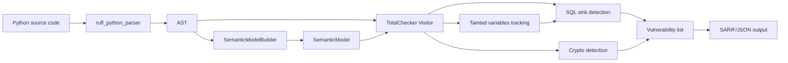

## 📜 scripts/install.sh

```bash
#!/bin/bash
# TOTAL Analyzer Installer
# Supports: Linux (binary), Docker (any OS), or build from source
# Usage: curl -sSL https://raw.githubusercontent.com/total-protocol/total-analyzer/main/scripts/install.sh | bash

set -euo pipefail

REPO="total-protocol/total-analyzer"
VERSION="v1.0-beta"
GHCR_IMAGE="ghcr.io/total-protocol/total-analyzer"

GREEN='\033[0;32m'
RED='\033[0;31m'
YELLOW='\033[1;33m'
NC='\033[0m'

log_info() { echo -e "${GREEN}[INFO]${NC} $1"; }
log_warn() { echo -e "${YELLOW}[WARN]${NC} $1"; }
log_error() { echo -e "${RED}[ERROR]${NC} $1"; exit 1; }

detect_os() {
    case "$(uname -s)" in
        Linux*)     OS="linux";;
        Darwin*)    OS="darwin";;
        *)          OS="unknown";;
    esac
}

detect_arch() {
    case "$(uname -m)" in
        x86_64)  ARCH="amd64";;
        aarch64) ARCH="arm64";;
        *)       ARCH="unknown";;
    esac
}

install_docker() {
    if command -v docker &> /dev/null; then
        log_info "Docker already installed"
        return
    fi
    log_warn "Docker not found. Installing Docker..."
    curl -fsSL https://get.docker.com | sh
    sudo usermod -aG docker "$USER"
    log_info "Docker installed. You may need to log out and back in."
}

install_binary() {
    detect_os
    detect_arch
    if [ "$OS" != "linux" ] || [ "$ARCH" != "amd64" ]; then
        log_error "Pre-built binary only available for Linux amd64. Please use Docker or build from source."
    fi
    BINARY_URL="https://github.com/${REPO}/releases/download/${VERSION}/total-analyzer_${OS}_${ARCH}"
    log_info "Downloading binary from $BINARY_URL"
    curl -L -o /tmp/total-analyzer "$BINARY_URL"
    chmod +x /tmp/total-analyzer
    sudo mv /tmp/total-analyzer /usr/local/bin/
    log_info "Binary installed to /usr/local/bin/total-analyzer"
}

install_from_source() {
    log_info "Building from source (requires Rust and Cargo)"
    if ! command -v cargo &> /dev/null; then
        log_error "Rust not installed. Install via https://rustup.rs/"
    fi
    git clone https://github.com/${REPO}.git /tmp/total-analyzer-src
    cd /tmp/total-analyzer-src
    cargo build --release
    sudo cp target/release/total-analyzer /usr/local/bin/
    cd - > /dev/null
    rm -rf /tmp/total-analyzer-src
    log_info "Built and installed from source"
}

main() {
    echo "TOTAL Analyzer Installer"
    echo "========================"
    PS3="Select installation method: "
    options=("Docker (recommended)" "Standalone binary (Linux only)" "Build from source" "Exit")
    select opt in "${options[@]}"; do
        case $opt in
            "Docker (recommended)")
                install_docker
                log_info "Run with: docker run --rm -v \$(pwd):/src $GHCR_IMAGE:$VERSION /src --sarif"
                break
                ;;
            "Standalone binary (Linux only)")
                install_binary
                break
                ;;
            "Build from source")
                install_from_source
                break
                ;;
            "Exit")
                exit 0
                ;;
            *) log_error "Invalid option";;
        esac
    done
    log_info "Installation complete. Try 'total-analyzer --help' or use Docker command above."
}

main "$@"
```

---

## 🏛️ docs/architecture.md

```markdown
# TOTAL Protocol Analyzer – Architecture Overview

## High-level design

TOTAL Analyzer is a **static analysis tool** for Python that detects:
- SQL injections via taint tracking
- Software cryptography suitable for hardware offload (Sentinel Guard)

It is written in **Rust** for performance and memory safety, using the **Ruff** ecosystem for AST and semantic analysis.



## Components

### 1. Parser & Semantic Model
- `ruff_python_parser` – converts source code to AST (Abstract Syntax Tree)
- `ruff_python_semantic` – resolves names, scopes, bindings across the same file (intra‑module only)

### 2. Taint Analysis (TotalChecker)
- **Source discovery**: function parameters decorated with `@route`, `@get`, `@post`, etc. (Flask/FastAPI)
- **Propagation tracking**:
  - assignments (`x = y`)
  - f‑strings: `f"...{tainted}..."`
  - string concatenation: `"..." + tainted`
  - function call arguments (unless sanitizer is called)
- **Sanitizers** (stop taint): `int()`, `float()`, `bindparam()`
- **Sinks** (dangerous calls): `.execute()`, `.executemany()`, `.raw()`, `.run_sql()`

### 3. Sentinel Guard
- Detects cryptographic functions by name: `encrypt`, `sign`, `PBKDF2`, `hash`, `hmac`
- Emits a **recommendation** (not a block) to offload to FPGA/HSM, with estimated performance gain and security level.

### 4. Output Formatter
- **JSON** (default): list of vulnerabilities with line numbers, severity, remediation
- **SARIF 2.1.0**: for native GitHub Code Scanning integration

## Data flow example

```python
@app.route("/user")
def get_user(id):                # <-- source (tainted starts here)
    query = f"SELECT * FROM users WHERE id = {id}"   # propagation
    db.execute(query)            # sink → alert
```

## Limitations (v1.0-beta)
- Intra‑procedural only (no cross‑function taint)
- No async/await DB sinks
- No Django ORM `raw()` detection
- No support for dynamic imports / reflection

See [LIMITATIONS.md](../LIMITATIONS.md) for full list.

## Build & runtime
- **Build**: Rust 1.75+ with Cargo, target `x86_64-unknown-linux-musl` for static binary
- **Runtime**: Alpine‑based Docker image (≤20 MB) or native Linux binary

## Future directions (v2.0)
- Cross‑function taint via call graph (using a graph database like Neo4j)
- Incremental scanning for CI
- Support for asyncpg, Django ORM, sqlite3
- Automatic PR generation for parameterized queries
- Rust language support (for Sentinel Core integration)

## Dependencies
| Crate | Purpose |
|-------|---------|
| `ruff_python_ast` | AST definitions |
| `ruff_python_parser` | Parse Python source |
| `ruff_python_semantic` | Name resolution, scopes |
| `ruff_source_file` | Source code location utils |
| `serde` / `serde_json` | JSON / SARIF serialization |
| `anyhow` | Error handling |

```

---

## 🐳 docker-compose.yml (Test environment)

```yaml
version: '3.8'

services:
  # TOTAL Analyzer service
  analyzer:
    image: ghcr.io/total-protocol/total-analyzer:v1.0-beta
    container_name: total-analyzer
    volumes:
      - ./examples:/src  # mount your project or examples
    command: /src --sarif
    profiles: ["scan"]
    # Output will be printed to stdout; capture via 'docker-compose up analyzer'

  # Test runner: builds the analyzer locally and runs integration tests
  test-runner:
    build:
      context: .
      dockerfile: Dockerfile  # uses the same Dockerfile to build from source
    container_name: total-analyzer-tests
    volumes:
      - ./:/app
    working_dir: /app
    command: cargo test -- --nocapture
    profiles: ["test"]

  # Demo web app (vulnerable Flask app) – for dynamic testing (optional)
  demo-app:
    image: python:3.11-slim
    container_name: vulnerable-demo
    working_dir: /app
    volumes:
      - ./examples:/app
    ports:
      - "5000:5000"
    command: python vulnerable_app.py
    profiles: ["demo"]
```

### Usage

```bash
# Run analyzer on examples/ directory, output SARIF
docker-compose --profile scan up analyzer

# Run integration tests (requires build context)
docker-compose --profile test up test-runner

# Start vulnerable Flask app (for manual testing)
docker-compose --profile demo up demo-app
```
